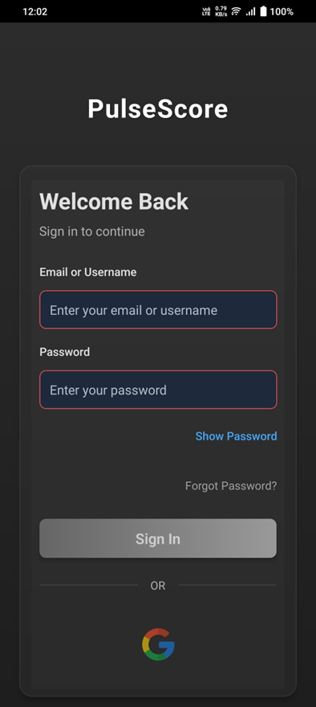
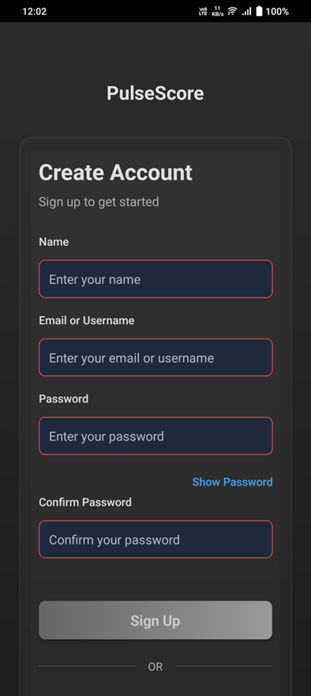
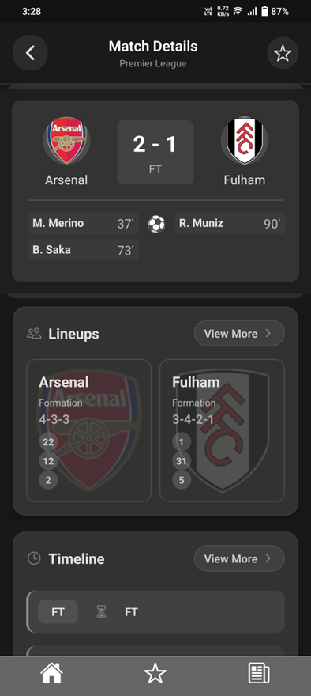
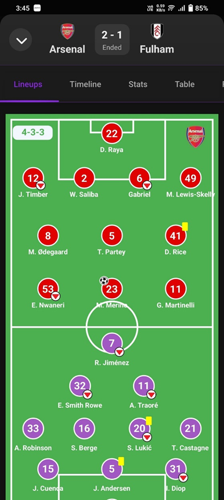
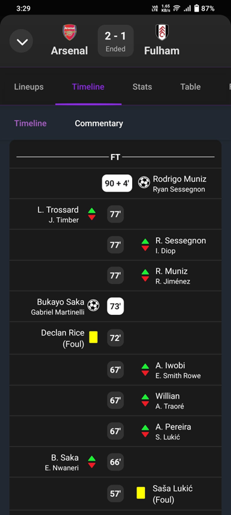
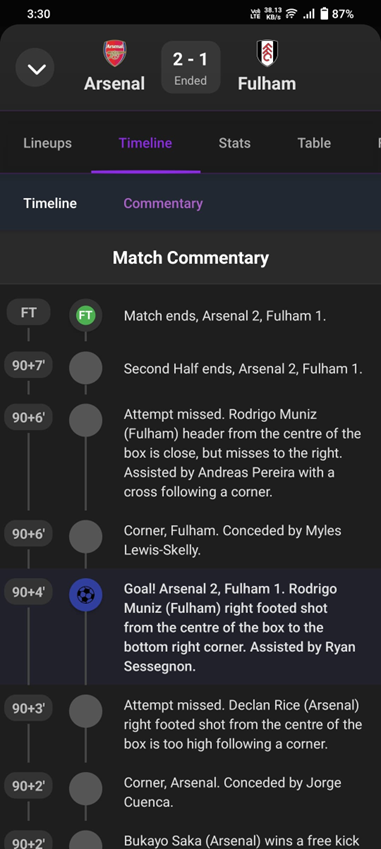
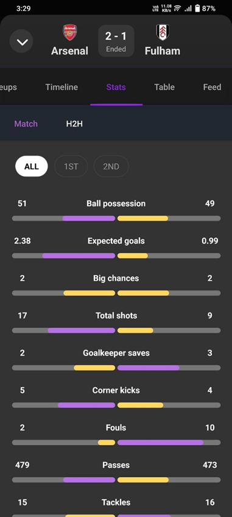
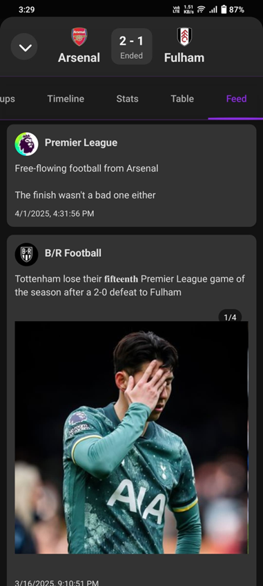
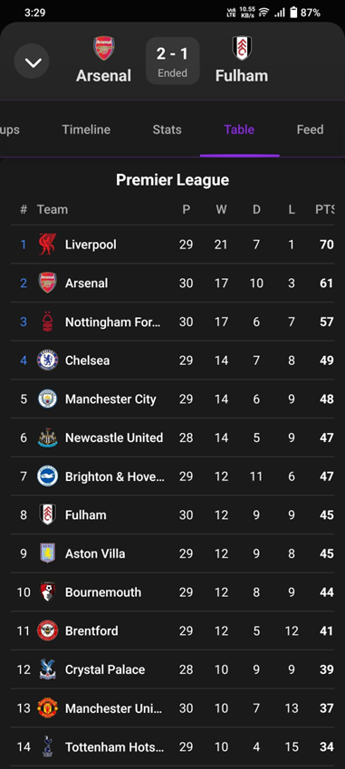

# ⚽🏀🏏 LiveScore

A **React Native** mobile app built with **Expo** that provides live scores for **Football**, **Basketball**, and **Cricket**.

---

## 📱 Features

- 🌐 Real-time score updates
- 🧭 Easy navigation between sports
- 📊 Clean and responsive UI
- ⚡ Built using React Native + Expo

---

## 🛠️ Tech Stack

- [React Native](https://reactnative.dev/)
- [Expo](https://expo.dev/)
- [JavaScript](https://developer.mozilla.org/en-US/docs/Web/JavaScript)
- [RapidAPI](https://rapidapi.com/)

---

## 📸 Screenshots

### 🔐 Login & Register 

<p float="left">
  
  &nbsp;&nbsp;&nbsp;
  &nbsp;&nbsp;&nbsp;
  &nbsp;&nbsp;&nbsp;
  
</p>

---

### 🏠 Home & News 

<p float="left">
  
  &nbsp;&nbsp;&nbsp;
  &nbsp;&nbsp;&nbsp;
  &nbsp;&nbsp;&nbsp;
  
</p>

---

### 📋 Match Details & Lineups

<p float="left">
  
  &nbsp;&nbsp;&nbsp;
  &nbsp;&nbsp;&nbsp;
  &nbsp;&nbsp;&nbsp;
  
</p>

---

### 🕒 Timeline & Commentary

<p float="left">
  
  &nbsp;&nbsp;&nbsp;
  &nbsp;&nbsp;&nbsp;
  &nbsp;&nbsp;&nbsp;
  
</p>

---

### 📊 Match Stats & Feed

<p float="left">
  
  &nbsp;&nbsp;&nbsp;
  &nbsp;&nbsp;&nbsp;
  &nbsp;&nbsp;&nbsp;
  
</p>

---

### 👤 Player Stats & Standings Table

<p float="left">
  
  &nbsp;&nbsp;&nbsp;
  &nbsp;&nbsp;&nbsp;
  &nbsp;&nbsp;&nbsp;
  
</p>

---

## 🚀 Installation

1. **Clone the repository**

```bash
git clone https://github.com/Pranavlot10/LiveScoreMobileApplication.git
cd LiveScoreMobileApplication
